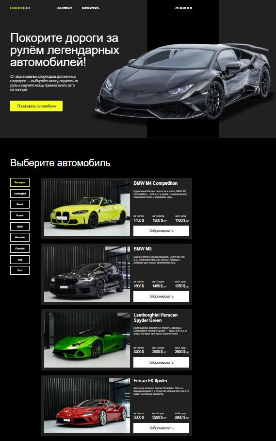
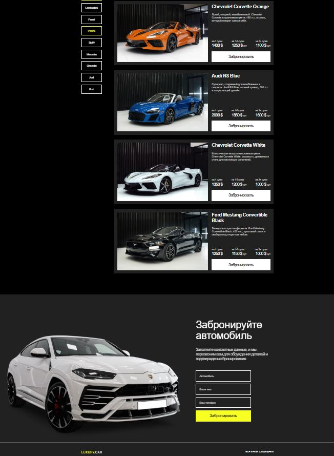

### Аренда премиальных автомобилей
Этот проект — учебная реализация дизайн-макета сайта по аренде премиальных автомобилей с использованием **HTML**, **CSS** и **JavaScript**. Он создан в рамках практики и предназначен для отработки навыков верстки, работы с интерактивными элементами и понимания структуры веб-страниц.

## 📚 О проекте

Проект представляет собой адаптацию готового дизайна в виде полноценной веб-страницы. Основной упор сделан на корректную реализацию верстки, соблюдение визуальной иерархии и точное соответствие макету.

## 💡 Цель

Цель проекта — закрепить навыки верстки, научиться точно переносить макет figma в код, глубже разобраться в работе с HTML, CSS и JavaScript, а также освоить создание интерактивных элементов (фильтрация, валидация форм).

## 🛠 Выполненная работа

- Размечена структура страницы с помощью HTML5
- Создана адаптивная и семантически правильная верстка
- Использованы современные возможности CSS для стилизации элементов (Flexbox, абсолютное позиционирование, sticky-элементы)
- Реализована фильтрация автомобилей по маркам с помощью JavaScript
- Добавлена валидация формы бронирования с визуальной обратной связью
- Обеспечено визуальное соответствие оригинальному дизайну

## Технологии

- **HTML5** — семантическая разметка страницы
- **CSS3** — стилизация, Flexbox, абсолютное и относительное позиционирование, кастомные цвета
- **JavaScript** — фильтрация автомобилей, валидация формы бронирования
- **Шрифты** — Helvetica

## 🗂 Структура

- `index.html` — главная HTML-страница
- `styles.css` — файл со стилями
- `script.js` — скрипты для фильтрации и валидации формы
- `images/` — папка с изображениями (логотип, автомобили)

## 🚀 Запуск проекта

1. Откройте файл `project/src/index.html` в любом современном браузере
2. Убедитесь, что все файлы изображений находятся на своих местах
3. Для корректной работы необходимо подключение к интернету (изображения автомобилей загружаются с внешнего сервера)

P.S: Для более удобного просмотра сайта предоставлена ссылка на GitHub Pages:

🔗 [GitHub Pages]()

## 📌 Примечание
Проект является учебным и предназначен для демонстрации навыков верстки и базовой работы с JavaScript. Форма бронирования не отправляет данные на сервер — реализована только клиентская валидация.

